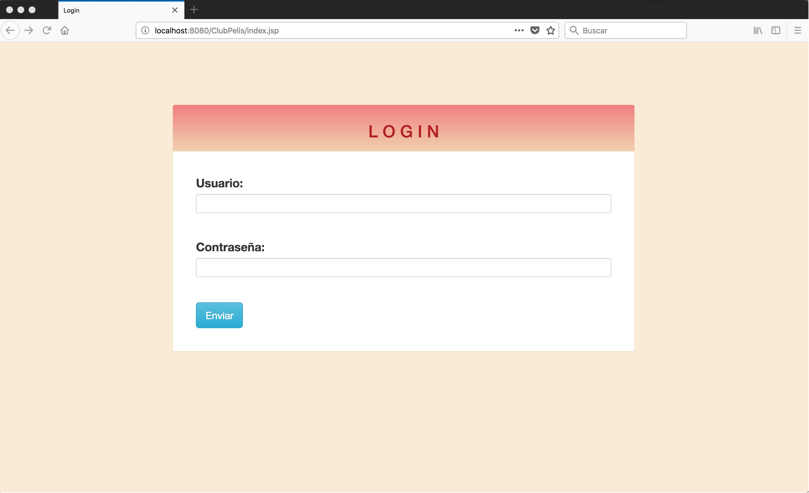
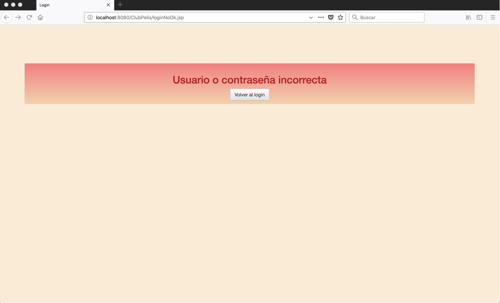
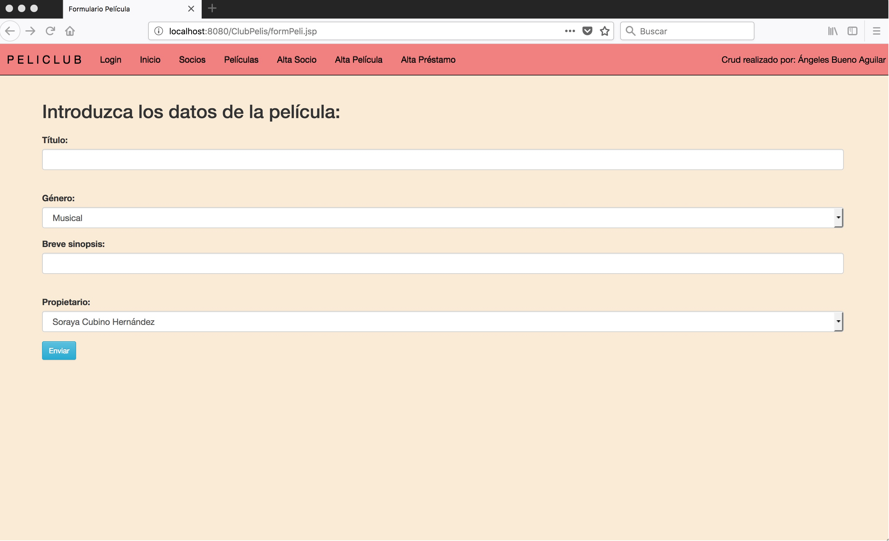
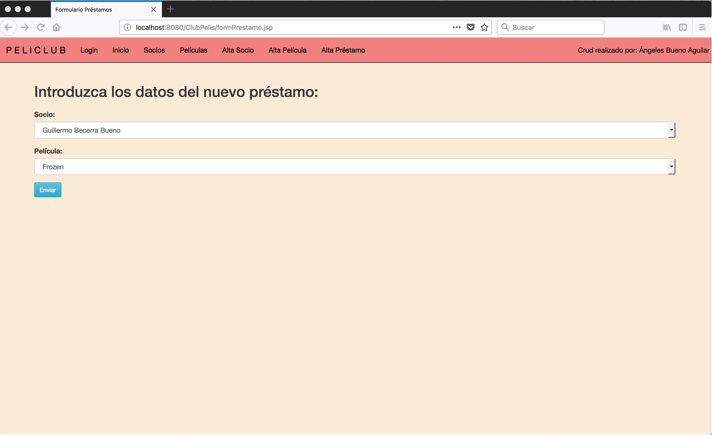

# CRUD_JSP-2.0
## Realizado por: Ángeleles Bueno Aguilar

Ampliación del Crud anterior --> [PeliClub](https://github.com/angelesbueno/CRUD_JSP)

En esta nueva versión he incorporado un login que aparecerá siempre que se inicie la aplicación, he modificado algunas etiquetas para que aparezcan como desplegables y también he cambiado para que los valores de una columna en una tabla se introduzcan en un ArrayList.
Para optimizar código, he separado todo el estilo un un archivo .css propio.

### Login: Aparece un formulario para introducir el nombre de usuario y la contraseña.

### Si no se introdujeran los datos correctamente, aparecería un mensaje de error.

### Alta Película. Nuevas etiquetas desplegables tanto en género como en propietario, donde ahora no habrá que introducir el código del propietario sino que aparecerán todos los nombres de los socios.

### Alta Préstamo. Nuevas etiquetas desplegables para el socio y la película. No habrá que introducir los códigos correspondientes sino que se podrán escoger dentro de una lista con los nombres de los socios y los nombres de las películas.

